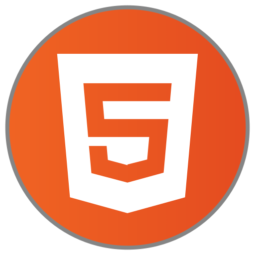

# Frontend Mentor - Results Summary Component Solution

This is a solution to the Results Summary Component challenge in Frontend Mentor (https://www.frontendmentor.io/challenges/results-summary-component-CE_K6s0maV). Frontend Mentor challenges help you improve your programming skills by creating realistic projects.

## Table of Contents

- [Frontend Mentor - Results Summary Component Solution](#frontend-mentor---results-summary-component-solution)
  - [Table of Contents](#table-of-contents)
  - [Summary](#summary)
    - [The Challenge](#the-challenge)
    - [Screenshot](#screenshot)
    - [Links](#links)
  - [My Process](#my-process)
    - [Created with](#created-with)
    - [Continuous Development](#continuous-development)
  - [Author](#author)
  - [Acknowledgments](#acknowledgments)

## Summary

After three years without touching code, I decided to once again take on the challenge of specializing as a Front-End developer. I'm not starting from scratch, because even though I don't remember everything right now, I know they're there, in my head, in my hands, and in my fingers.
I decided to start simple, remembering basic concepts and processes. So I take on beginner challenges like Front-End.

### The Challenge

Users will be able to:

- View the optimal interface layout based on their device's screen size
- View the hover and focus states of all interactive elements on the page
- **Bonus**: Use local JSON data to dynamically populate content.

### Screenshot

### Links

- Solution URL: [Code](https://github.com/devcjoha/results-summary-component-main)
- Website URL: [Deploy] [here](https://results-summary-frontendm.netlify.app/)

## My Process
As expected, I didn't even remember that I had to finish with [in Javascript], the programs to install, preparing the PC, the keyboard shortcuts. How fun! I dusted off my notebooks, my Notion notes, my old Github account, etc.
I didn't hesitate for a minute to do the EXTRA challenge, which was appropriate for my memory improvement.

### Created with

### Continuous Development

I've already designed my learning path with everything I need to remember and advance in my specialization. This is the small first step.

## Author

- Website - [Carla Johanna](https://github.com/devcjoha)
- Frontend Mentor - [@devcjoha](https://www.frontendmentor.io/profile/yourusername)
- X - [@CarlitaJohanna](https://www.x.com/carlitajohana)

## Acknowledgments

I'm grateful to everyone who contributed to every learning experience in my life. I'm grateful to my colleagues during those hours on Discord and other rooms, racking our brains to move forward and continue learning.

👋🏻